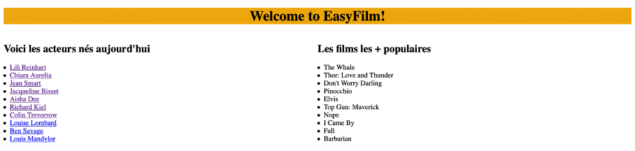
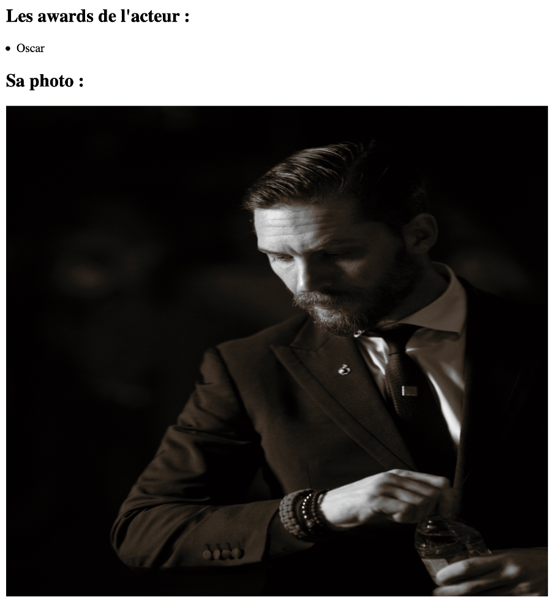

# APIFilmProject

To launch locally in terminal

Clone this project and then open a terminal, move in the projet folder and execute the following commands :

```bash 
pip install -r requirements.txt
export FLASK_ENV=development   
export FLASK_APP=application.py
flask run
```

Once the command executed, the terminal launch the local address and its port associated : 


We can now click on this address or use it in our browser.

Once we did it, our web application will display.
It can take a few secondes because several API requests are sent during the loading of the page.



On this page, we can find 2 of our features. The first one display actors that are born today and the second one show us the popular movies of the moment.

We can now click on an actor (for example Tom Hardy) and this page will appear 



Here, we can see our 2 last features. In fact, the third one displays the awards of the actor and the last one displays a picture of the actor.

Our CI/CD chain

This one is composed with 2 jobs :


